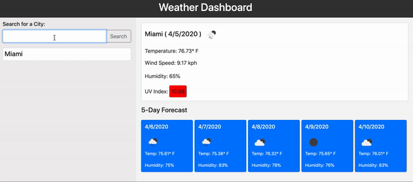

# Weather Dashboard

This application allows the user to look up a city by name and display the current weather along with the upcoming five-day forecast. This app will run in the browser and feature dynamically updated HTML and CSS powered by jQuery.

# Usage
Upon visiting the Weather Dashboard, type the name of a city into the search bar and click the search button. The panels to the side will display the current weather of the searched city ((temperature, wind speed, humidity, UV index). The UV index will change color depending upon the UV Index range: 

0 to 2	Green	"Low"
3 to 5	Yellow	"Moderate"
6 to 7	Orange	"High"
8 to 10	Red	    "Very high"
11+	    Violet	"Extreme"

Below the current weather, blue panels display the upcoming 5-day forecast (weather, temperature, humidity).

A loist of searched will appear as buttons below the search bar as the user inputs cities. These button can be pressed again to revisit the forecast information.

# Image
The following animation demonstrates the application functionality:

# Credits
API's
https://openweathermap.org/current
https://openweathermap.org/forecast5
https://openweathermap.org/api/uvi

YouTube:
https://www.youtube.com/watch?v=GXrDEA3SIOQ

# URL
https://ryansparker.github.io/work-day-scheduler/

# GitHub Repository
https://github.com/ryansparker/work-day-scheduler

© 2020 Ryan Parker All Rights Reserved.

